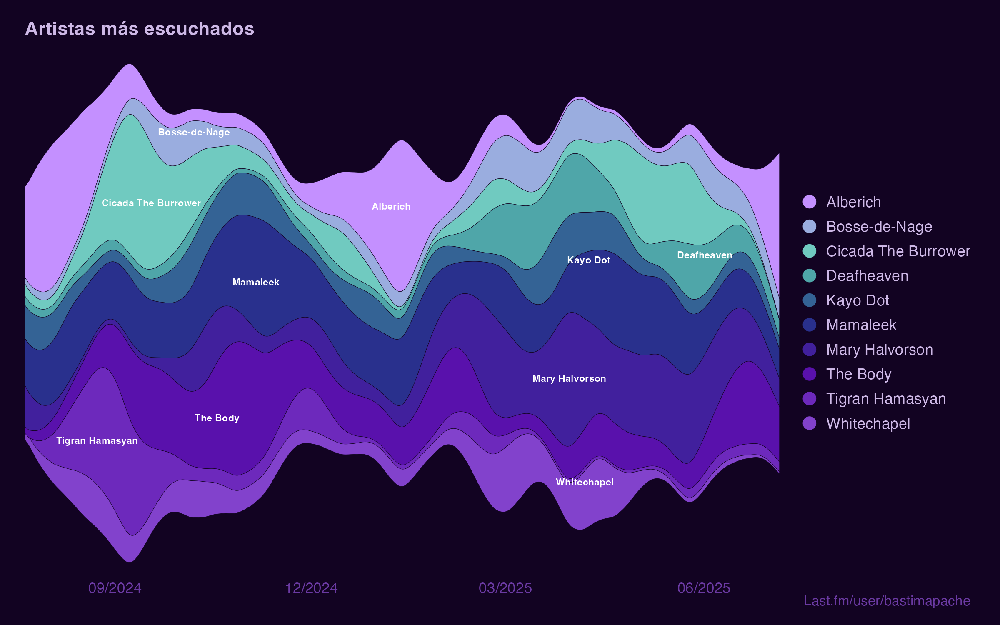
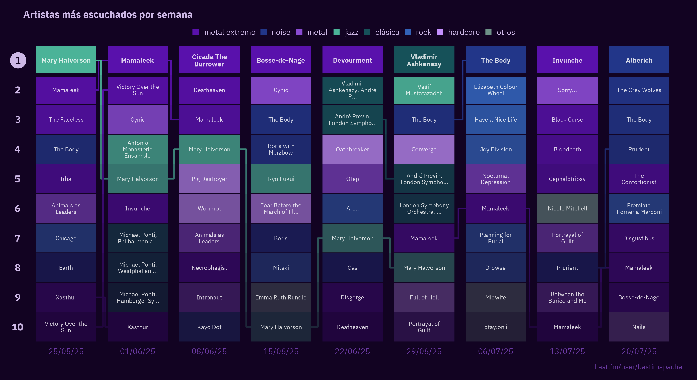
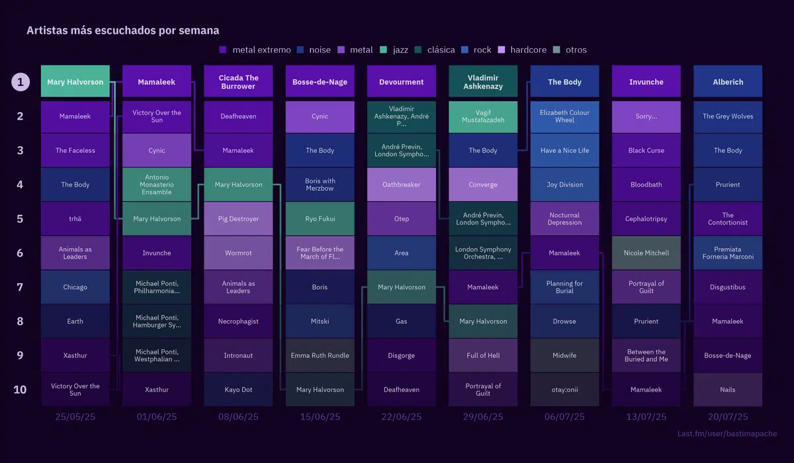

## Visualizaciones de artistas y géneros más escuchados en Last.fm

Contiene scripts para obtener tus datos de scrobbles de Last.fm y generar gráficos de géneros y artistas más escuchados.

La idea era replicar en R el gráfico que parece para los usuarios de Last.fm Pro.

Post explicativo con pasos a seguir y código: https://bastianolea.rbind.io/blog/2025-07-28/

### Gráficos

### Inspiración

